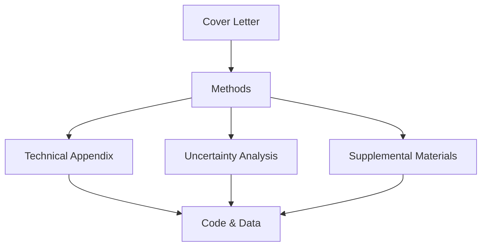

# Documentation Guide

## Overview
This guide provides a roadmap for navigating the documentation of our gender disparities analysis in clinical trials. The documentation is structured to meet The Lancet's submission requirements while ensuring transparency and reproducibility.

## Document Structure

### 1. Main Manuscript Components
- **Cover_Letter.md**
  - Introduction to the research
  - Key findings and significance
  - Relevance to The Lancet
  - Submission contents and declarations

- **Methods.md**
  - Core methodology
  - Study design
  - Statistical approach
  - Software and reproducibility

### 2. Technical Documentation
- **Technical_Appendix.md**
  - Detailed model specification
  - Mathematical formulations
  - Implementation details
  - Extended methodology

- **Uncertainty_Analysis.md**
  - Sources of uncertainty
  - Quantification methods
  - Sensitivity analyses
  - Robustness checks

### 3. Supplementary Materials
- **Supplemental_Materials.md**
  - Extended data tables
  - Additional figures
  - Detailed methods
  - Code availability

## Navigation Guide

### For Reviewers
1. Start with Cover_Letter.md for research overview
2. Review Methods.md for core methodology
3. Consult Technical_Appendix.md for detailed specifications
4. Examine Uncertainty_Analysis.md for robustness
5. Reference Supplemental_Materials.md for additional details

### For Reproducibility
1. Follow repository structure in Supplemental_Materials.md
2. Use provided environment.yml for setup
3. Execute analysis following documented steps
4. Verify results against provided figures and tables

## File Locations

```
project_root/
├── Cover_Letter.md
├── docs/
│   ├── Methods.md
│   ├── Technical_Appendix.md
│   ├── Uncertainty_Analysis.md
│   ├── Supplemental_Materials.md
│   └── Documentation_Guide.md
├── src/
│   ├── analysis/
│   ├── validation/
│   └── visualization/
├── figures/
│   └── participation_analysis.png
└── requirements.txt
```

## Document Relationships



## Version Information
- Documentation Version: 1.0
- Last Updated: March 29, 2025
- Status: Final for Submission

## Contact
For questions about documentation:
- [Contact Information]
- [Institutional Affiliation]

